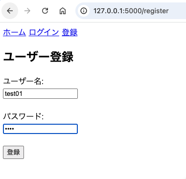
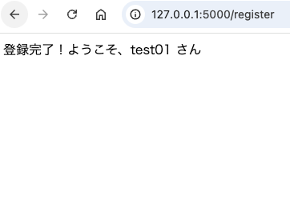
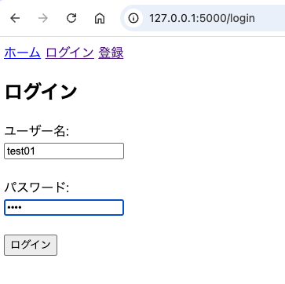
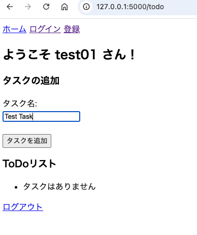

# Flask To-Do アプリ

## 概要
学習目的で構築したシンプルな **To-Do管理アプリ** です。  
最初は JSON ファイルでデータを保存し、ユーザー認証とタスク管理を実装しました。  
その後、SQLite へ移行する過程で「セキュリティ課題 → 改善対応」を経験し、開発プロセスを通じて **バックエンド基盤・データベース・セキュリティ** への理解を深めました。

---

## 機能一覧
- ユーザー登録・ログイン・ログアウト
- パスワードハッシュ化による安全な認証（改善後）
- タスクの追加・一覧表示・削除
- セッション管理によるログイン状態保持
- JSON 保存版 → SQLite 保存版への移行

### アプリ画面

### 登録画面


### ログイン画面


### To-Doリスト画面（タスク登録画面）


---

## 技術スタック
- **フレームワーク**: Flask
- **DB**: SQLite, JSON（学習用）
- **認証**: werkzeug.security (generate_password_hash / check_password_hash)
- **テンプレート**: Flask Jinja2
- **その他**: セッション管理, RESTfulルーティング

---

## 実装プロセスと学び

### 1. JSON版（初期実装）
- **特徴**
  - ユーザー情報とタスクを `users.json` / `tasks.json` に保存
  - **パスワードはハッシュ化**して保存（セキュリティの基礎の勉強・実践）
- **学び**
  - Web認証の基礎
  - ハッシュ化によるセキュリティ強化の重要性
  - JSONによる簡易データ永続化

#### コード例（安全なパスワード保存）
```python
from werkzeug.security import generate_password_hash, check_password_hash

# 登録時
hashed_password = generate_password_hash(password)
users[username] = hashed_password

# ログイン時
if username in users and check_password_hash(users[username], password):
    session['username'] = username
```

### 2. SQLite版（移行時）
- **特徴**: SQLによる効率的なデータ管理  
- **課題**: パスワードを一時的に平文保存（重大なセキュリティ欠陥）

#### 3. 改善後
- **改善**: `generate_password_hash` / `check_password_hash` を導入し、SQLiteでも安全な認証を実装  
- **学び**: 「単に実装して終わり」だけでなくセキュリティ要件を満たす重要性や意識を実感

## 成果
- バックエンドの基礎を一通り経験
- JSON → SQLite の移行を通じてデータ管理スケールを実感
- セキュリティ課題を経験し改善した

## 今後の展望
- Reactを用いたフロントエンド実装（学習中）
- API化によるフロント・バック分離
- Docker化による環境整備
